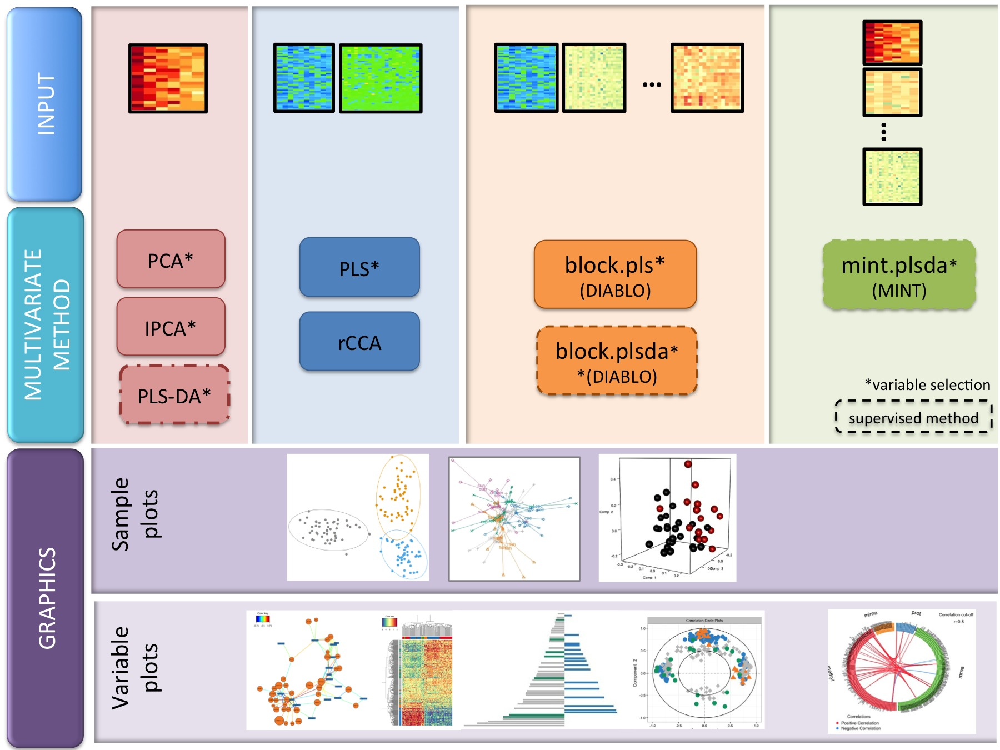

--- 
title: 'mixOmics vignette'
## for BiocStyle and pdf output:
author: 'Kim-Anh Le Cao, Sebastien Dejean, Al J Abadi'
## for gitbook html output:
## author: |
##   Kim-Anh Le Cao^[Melbourne Integrative Genomics & School of Mathematics and Statistics, The University of Melbourne],
##   Sebastien Dejean^[Institut de Mathematiques de Toulouse, UMR 5219 | CNRS and Universite de Toulouse, France],
##   Al J Abadi^[Melbourne Integrative Genomics & School of Mathematics and Statistics, The University of Melbourne]

package: mixOmics
date: '\today'
site: bookdown::bookdown_site
output: 
  bookdown::gitbook:
    includes:
     in_header: header.html
documentclass: book
bibliography: ["mybib.bib"]
biblio-style: apalike
link-citations: true
github-repo: mixOmicsTeam/mixOmics
description: "Vignette for the R package mixOmics"
---
```{r, include=FALSE}
library(knitr)
# global options - probably better to put out.width='60%' for pdf output
knitr::opts_chunk$set(dpi = 100, echo=TRUE, warning=FALSE, message=FALSE, eval = TRUE, cache=TRUE,
                      fig.show=TRUE, fig.asp=1,fig.align='center', out.width = '75%',
                      fig.pos= "h", out.extra = '', fig.path= 'Figures/')
```

```{r 00-htmlTemplate, echo=FALSE, eval=FALSE}
## run this only to re-make the logo in header.html
## Create the external file
img <- htmltools::img(src = knitr::image_uri("XtraFigs/logo-mixomics.jpg"),
               alt = 'logo',
               style = 'position:absolute; top:25px; right:1%; padding:10px;z-index:200;')

htmlhead <- paste0('
<script>
document.write(\'<div class="logos">',img,'</div>\')
</script>
')

readr::write_lines(htmlhead, path = "header.html")
```

# Preface {-}

This document outlines the use of our key functions in our mixOmics package. If you run into any issues reproducing these results, please let us know by creating an issue here. We welcome transparent discussions and suggestions, feel free to on our new mixOmics Discourse forum!

This document outlines the use of our key functions in our _mixOmics_ package. If you run into any issues reproducing these results, please let us know by creating an issue [here](https://github.com/mixOmicsTeam/Bookdown/issues). We welcome transparent discussions and suggestions, feel free to share your own on our new [mixOmics Discourse forum](https://mixomics-users.discourse.group/).

Our toolkit includes 17 new multivariate methodologies some depicted below depending on the data to integrate and the biological questions (e.g. exploration, discriminant analysis, data integration for 2 or more data sets).

```{r 00-index-key-funcs, echo=FALSE, out.width='100%'}

```
